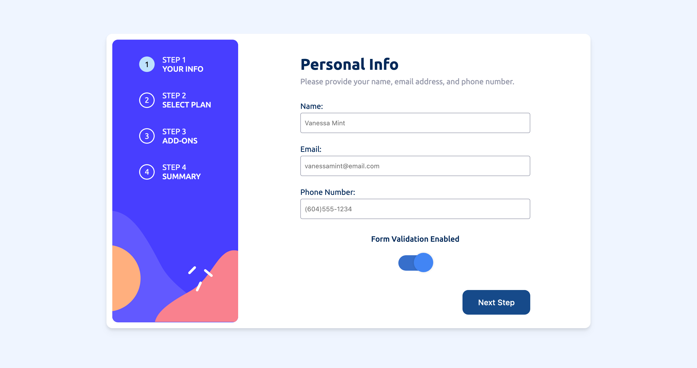
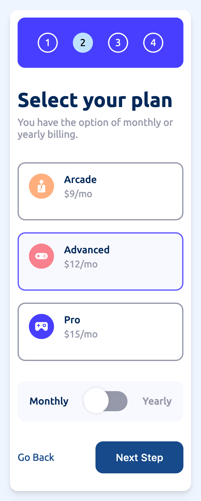

# Multi-step form built with Alpine.js

This is an interactive and dynamic multi-step form showcasing the power of the frontend framework: [Alpine.js](https://alpinejs.dev/).
<br>You can view the live deployment [here](https://multistep-form-tc.netlify.app/).

## Table of contents

- [Overview](#overview)
  - [Features & Functionality](#overview)
  - [Screenshots](#screenshots)
- [My process](#my-process)
  - [Built with](#my-process)
  - [What I learned](#what-i-learned)
  - [Continued development](#continued-development)
  - [Useful resources](#useful-resources)
- [Author](#author)

## Overview

### Features and Functionality

Users should be able to:

- Complete each step of the sequence
- See a summary of their selections with their inputted information
- Toggle between monthly and yearly payments
- Toggle form validation (for testing purposes)
- View the optimal layout for the interface depending on their device's screen size

### Screenshots

#### Desktop Version


#### Mobile Version


## My process

### Built with

- HTML5
- CSS3
- Alpine.js
- Flexbox
- CSS Grid

### What I learned

This was my first experience with Alpine.js. I really enjoyed being able to control state within directives in parent HTML elements.

For example, I kept the state of the active tab within an `x-data` variable:

```html
<div x-data="{ activeTab: 'stepOne' }</div>
```
This was used for routing and helped create the SPA experience.

I also tracked the order dollar amounts in `x-data` variables too:

```js
{ monthlyTotal: 12, yearlyTotal: 90, addonsMonthlyTotal: 0, addonsYearlyTotal: 0 }
```

I enjoyed using `x-text` to dynamically add in information inputted in the html form:

```html
<h3 x-text="`Name: ${name}`"></h3>
```

### Continued development

I would like to explore this framework's Attributes, Properties, and Methods further and work on avoiding redundancy. 

### Useful resources

- [Alpine.js Docs](https://alpinejs.dev/start-here) - The Alpinejs docs are well written and clear and was a great resource to find the right attributes and properties needed during my development.
- [Alpine.js Full Course For Beginners | 4+ hours tutorial | Youtube](https://youtu.be/5ILDMMLgX0E) - This is a great Youtube video with timestramps on different scenarios for using Alpinejs, I used this video to structure some ideas during my development.

### Author

- Website - [Tyrell Curry](https://www.your-site.com)
- Linkedin - [Tyrell Curry](https://www.linkedin.com/feed/)
- Twitter - [@Tyrell_io](https://twitter.com/Tyrell_io)
